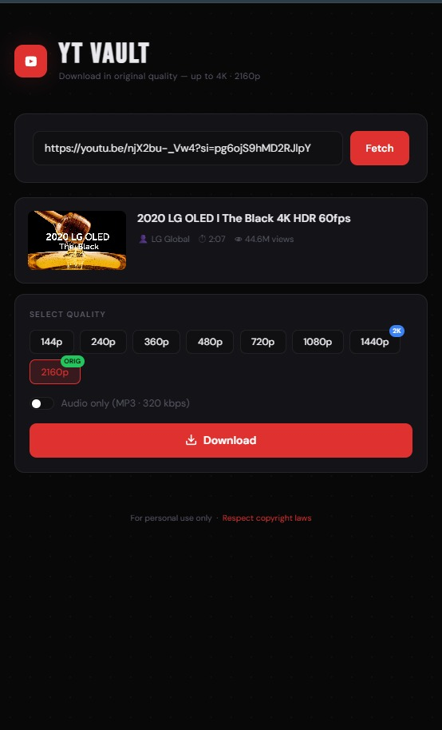

<div align="center">

# 🎬 YT Vault

### 4K YouTube Downloader

[](https://python.org)
[](https://djangoproject.com)
[](https://github.com/yt-dlp/yt-dlp)
[](https://ffmpeg.org)

**Download YouTube videos up to 4K or extract audio as MP3 — fast, clean, no sign-in.**

</div>

---

<div align="center">
  
</div>

---

## ✨ Features

- 🎥 **144p to 4K** — All quality options, auto-detects original upload quality
- 🎵 **MP3 extraction** — Audio-only downloads at 320 kbps
- ⚡ **Server-side merging** — FFmpeg combines video + audio streams seamlessly
- 🧹 **Auto cleanup** — Temp files wiped after 2 hours
- 🌙 **Dark UI** — Responsive, works on desktop & mobile
- 🔓 **No auth needed** — Just paste a link and go

---

## 🎞️ FFmpeg Installation Guide

FFmpeg is **required** for downloads above 720p (it merges separate video + audio streams).

<details>
<summary>🪟 <b>Windows</b></summary>

1. Download FFmpeg from [gyan.dev](https://www.gyan.dev/ffmpeg/builds/) — grab the **ffmpeg-release-essentials.zip**
2. Extract the zip to a folder, e.g. `C:\ffmpeg`
3. Inside you'll find `C:\ffmpeg\bin\ffmpeg.exe`
4. **Add to PATH:**
   - Press `Win + S` and search **"Environment Variables"**
   - Click **"Edit the system environment variables"**
   - Click **Environment Variables** button
   - Under **System variables**, find `Path` and click **Edit**
   - Click **New** and add: `C:\ffmpeg\bin`
   - Click **OK** on all windows
5. **Verify** — open a new terminal and run:
   ```bash
   ffmpeg -version
   ```

</details>

<details>
<summary>🍎 <b>macOS</b></summary>

Using [Homebrew](https://brew.sh/):

```bash
brew install ffmpeg
```

FFmpeg is automatically added to PATH. Verify with:

```bash
ffmpeg -version
```

</details>

<details>
<summary>🐧 <b>Linux (Ubuntu/Debian)</b></summary>

```bash
sudo apt update && sudo apt install ffmpeg -y
```

FFmpeg is automatically added to PATH. Verify with:

```bash
ffmpeg -version
```

</details>

> **Tip:** If you see `ffmpeg is not recognized` or `command not found`, restart your terminal after installing.

---

## 🚀 Quick Start

```bash
# Clone & setup
git clone https://github.com/Nilayan8513/yt_download.git
cd yt_download
python -m venv .venv && source .venv/bin/activate
pip install -r Requirement.txt && pip install -U yt-dlp

# Run
python manage.py migrate
python manage.py runserver
```

> Open **http://127.0.0.1:8000** and start downloading!

---

## 🛠️ Tech Stack

| | Technology | Purpose |
|---|---|---|
| 🐍 | **Python + Django** | Backend framework |
| 📥 | **yt-dlp** | Video extraction engine |
| 🎞️ | **FFmpeg** | Audio/video stream merging |
| 📦 | **WhiteNoise** | Static file serving |
| 🚀 | **Gunicorn** | Production WSGI server |
| 🎨 | **Vanilla JS/CSS** | Frontend (no framework) |

---

## 📁 Project Structure

```
yt_download/
├── youtube_downloader/    # Django project settings
├── ytdl_app/
│   ├── templates/
│   │   └── index.html     # Single-page UI
│   ├── views.py           # API endpoints & download logic
│   └── urls.py            # App routing
├── assets/
│   └── preview.png        # UI screenshot
├── manage.py
├── Requirement.txt
└── build.sh               # Render deployment script
```

---

## 🔌 API Endpoints

| Method | Endpoint | Description |
|---|---|---|
| `GET` | `/` | Serves the UI |
| `POST` | `/api/info/` | Fetch video metadata & available qualities |
| `POST` | `/api/download/` | Process & prepare download |
| `GET` | `/api/file/<id>/<name>` | Stream the file to browser |
| `POST` | `/api/cleanup/<id>` | Delete temp files |

---

## ⚙️ Environment Variables

| Variable | Default | Description |
|---|---|---|
| `SECRET_KEY` | dev key | **Change in production!** |
| `DEBUG` | `True` | Set `False` in production |
| `DOWNLOAD_TEMP_DIR` | `temp_downloads/` | Temp file directory |
| `FFMPEG_PATH` | auto-detected | Path to FFmpeg binary |

---

## 🌐 Deploy on Render

1. Create a **Web Service** on [Render](https://render.com) and connect the repo
2. Set `SECRET_KEY` and `DEBUG=False` in environment
3. **Build Command:** `./build.sh`
4. **Start Command:** `gunicorn youtube_downloader.wsgi:application`

---

## ⚠️ Disclaimer

> **For personal use only.** Respect YouTube's Terms of Service and copyright laws. If downloads stop working, update yt-dlp: `pip install -U yt-dlp`

---

<div align="center">

**Built with ❤️ by [Nilayan](https://github.com/Nilayan8513)**

</div>
